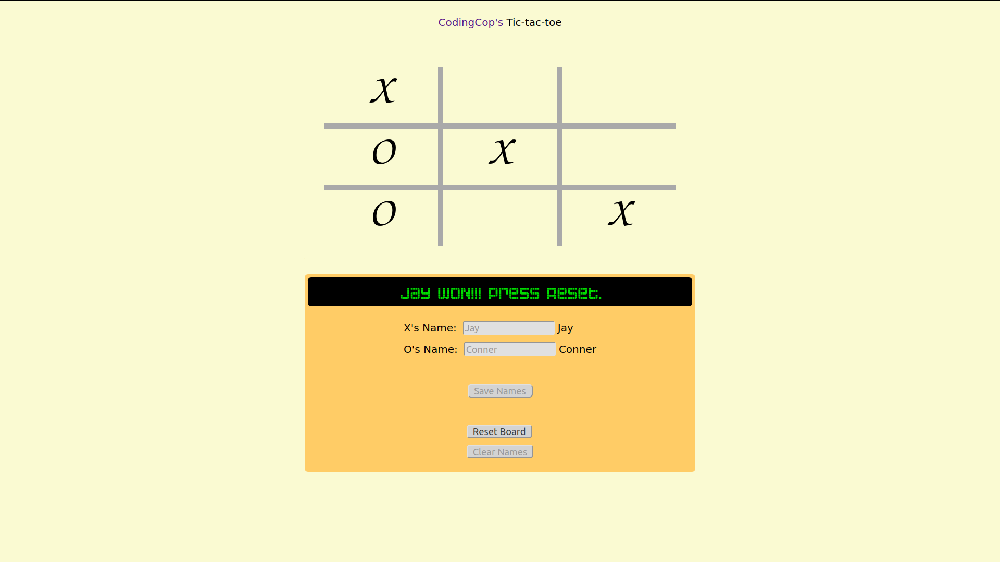

# HTML/CSS/JavaScript Tic-Tac-Toe Game

Play tic-tac-toe online via a JavaScript enabled game on an HTML page. This game allows users to enter their names, and the display will prompt each user, by name, to play when it's their turn. Try playing the game at [Tic-Tac-Toe](https://htmlpreview.github.io/?https://github.com/cleve703/tic-tac-toe/blob/main/index.html). Check out the GitHub repository at [GitHub](https://github.com/cleve703/tic-tac-toe/blob/main/index.html).

## Purpose

I completed this project as part of the full-stack web development curriculum at [theOdinProject](https://theodinproject.org), in order to learn and demonstrate my proficiency in the use of JavaScript. Specifically, this project focuses on using modules, factory functions, and closures.

## Built With

* HTML5
* CSS3
* JavaScript

## Project Status

As of December 7, 2020, I have completed the assignment as intended. However, in the future I may revisit it, in order to add the options of using a computer opponent.

## About Me

* My name: Jay Conner
* My website: [CodingCop](https://codingcop.com)
* My Twitter: [@JayConner17](https://twitter.com/JayConner17)
* My LinkedIn: [LinkedIn](https://www.linkedin.com/in/jay-c-8000196)